# Triceratop Republic

  

# Contributors

[Gabe Chacon](https://github.com/gabinochacon8 "Gabe Chacon")

[Sam Sparks](https://github.com/sgsparks "Sam Sparks")

[Louisa Janßen](https://github.com/louisajanssen "Louisa Janßen")

[Ming Wen](https://github.com/level1man "Ming Wen")

# Introduction
Triceratop Republic is a single-page e-commerce HTML5 web application designed to showcase clothing products. The application includes an overview with general product information, a related products section to compare items and add them to a personal outfit list. Also contains a question and answers section as well as ratings and reviews.

# Tech stack
<ul>
<li>React(with hooks)</li>
<li>Webpack/Babel</li>
<li>Jest</li>
<li>React Testing Library</li>
<li>Express/Morgan</li>
<li>Axios</li>
<li>NodeJS</li>
<li>CSS styled components</li>
<li>Circle.CI</li>
<li>AWS</li>
<li>Azure</li>
</ul>

# Technical Challenges and Research
Some unexpected challenges included:

<ul>
<li>Building the image and related products carousels</li>
<li>Dynamically rendering features with asynchronous HTTP requests</li>
<li>Reduced time to first contentful paint and time to interactivity</li>
<li>App wide integration of accessibility practices</li>
<li>Something about endpoints and APIS ***********</li>
</ul>

# User Stories
<ul>
<li>As a user, I should be able to see multiple photos for chosen product</li>
<li>As a user, I should be able enhance main photo</li>
<li>As a user, I expect to see multiple styles for an individual product</li>
<li>As a user, I should be able to choose size, quantity, add to cart, and/or add to personal outfits</li>
<li>As a user, I should be able to see related products in a carousel</li>
<li>As a user, I should be able to interact with related product card to compare features with current product</li>
<li>As a user, I should be able to view and delete items from personal outfit list</li>
<li>As a user, I should be able to search through a list of questions and answers about the current product</li>
<li>As a user, I should be able to add a new question about the product</li>
<li>As a user, I should be able to answer other questions and add photos relating to the question</li>
<li>As a user, I should be able to view the overall rating and characteristics breakdown of each item</li>
<li>As a user, I should be able to view a list of all reviews pertaining to the individual product</li>
<li>As a user, I should be able to add my own review to each item with photos</li>
<li>As a user, I should be able to see a dynamically rendered star average rating</li>
<li>As a user, I should be able to sort reviews based on helpfulness, newest, or relevance</li>
<li>As a user, I should be able to report or upvote individual questions, answers and reviews</li>
<li>As a user, I should be able to switch application to light or dark theme</li>
</ul>

# How does the app work?
<h1>Full Page Application</h1>

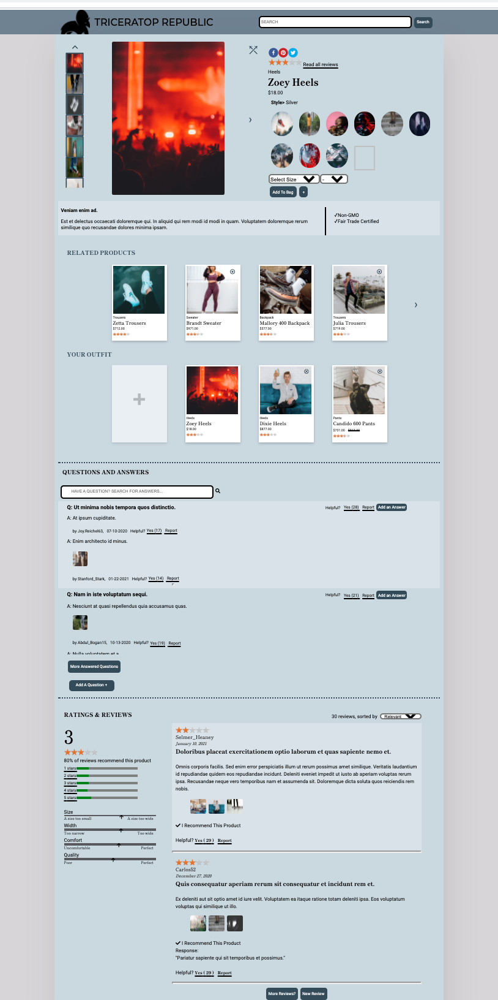

<h1>Product Overview:</h1>

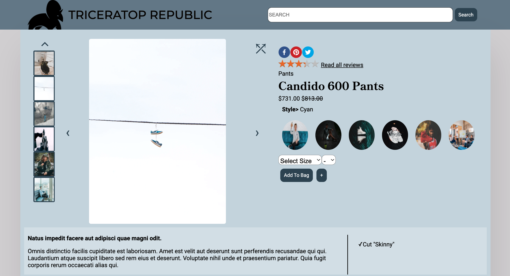

<h1>Product Image Enhanced:</h1>

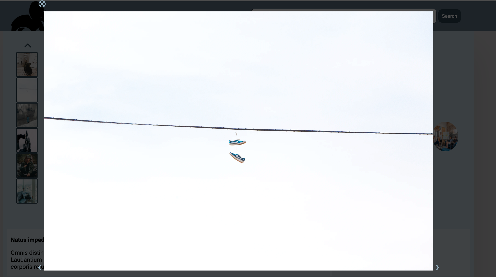

<h1>Choosing Size:</h1>

<h1>Related Products and Outfit List:</h1>

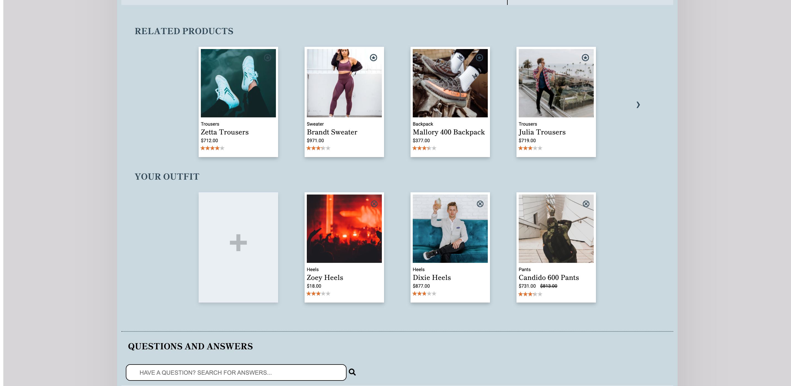

<h1>Compare Products Modal:</h1>

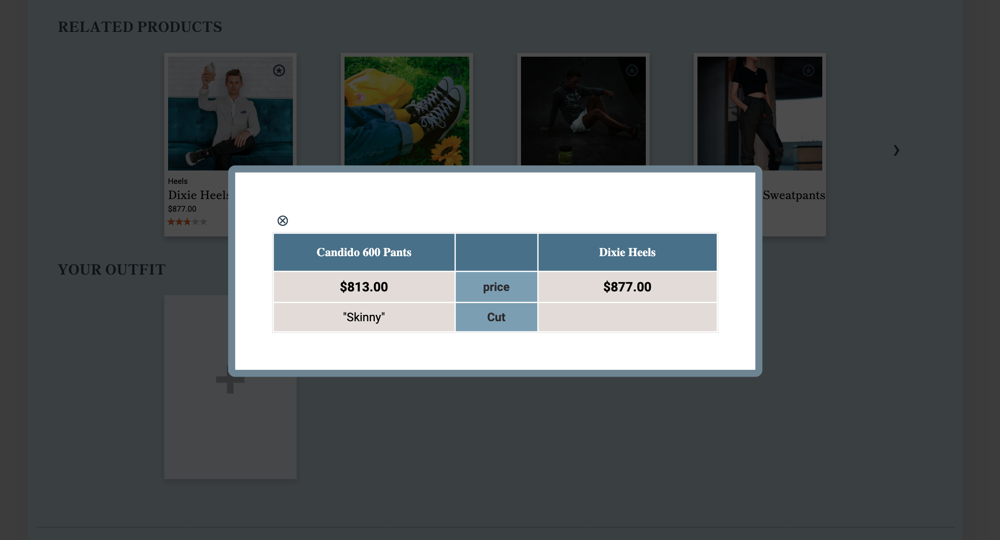

<h1>Questions and Answers:</h1>

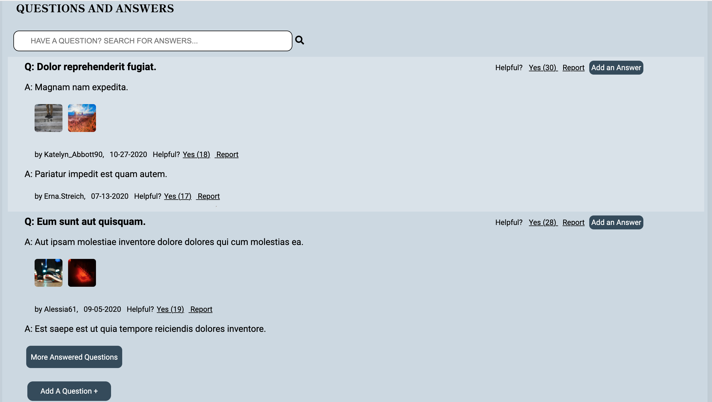

<h1>Add a Question:</h1>

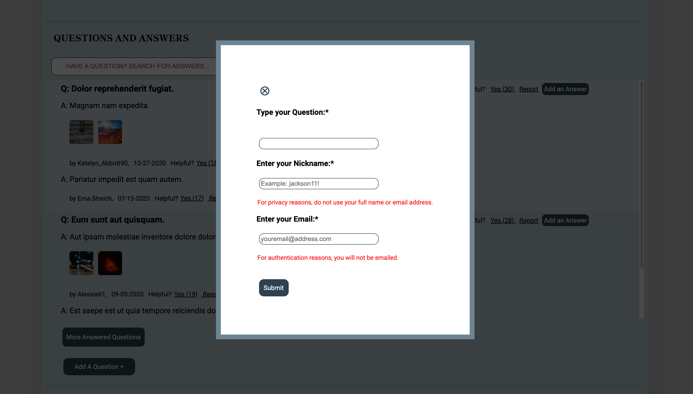

<h1>Add an Answer:</h1>

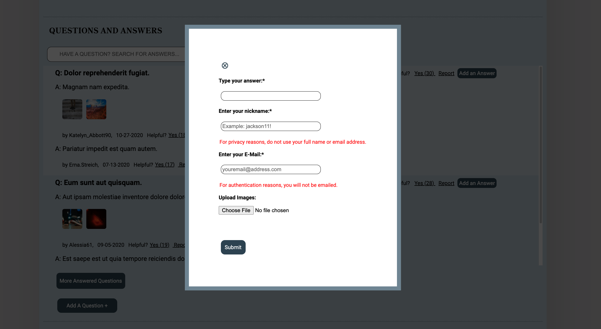

<h1>Ratings and Reviews:</h1>

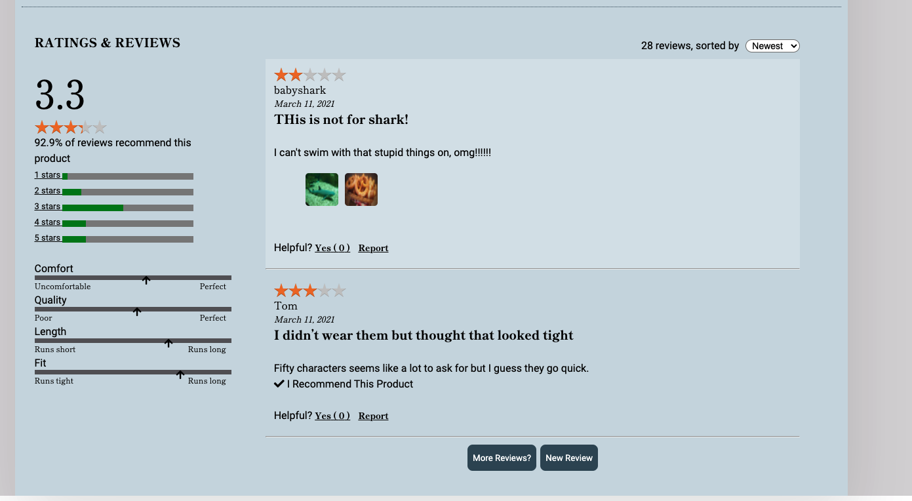

<h1>More Reviews Modal:</h1>

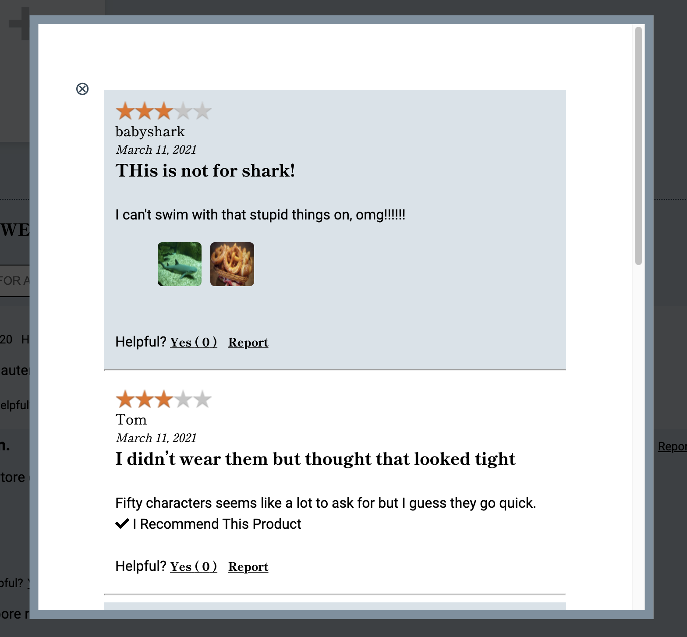

<h1>New Review Form:</h1>

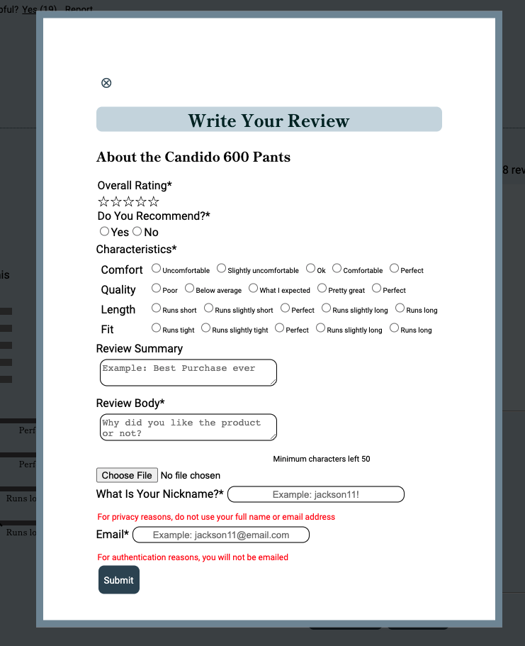

# Workflow and Key Lessons
Workflow was managed through GitHub and utilizing Agile workflow through Trello ticketing system.  The team also had daily standup meetings to ensure everyone was on the same page on what was getting worked on and what still needed to be done.